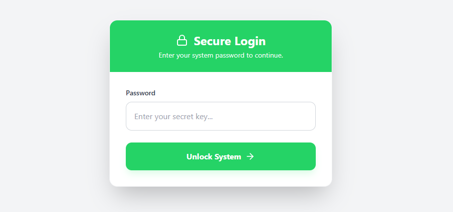
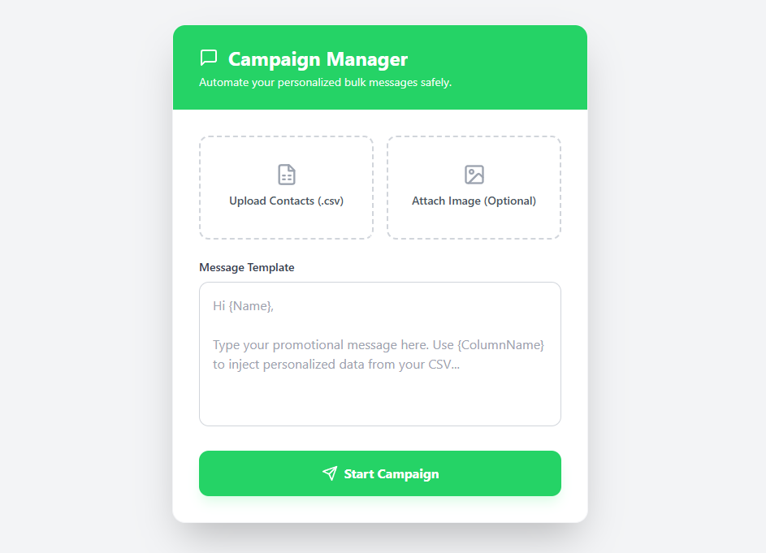

# 🚀 WABulker
**A fully self-hosted, highly secure, and lightweight WhatsApp Bulk Messaging engine.**

Built specifically to run on ultra-low-resource cloud environments (like Oracle Cloud's 1GB RAM Always Free tier), this project uses a **FastAPI** backend, **Playwright** for headless browser automation, and a **React/Vite** frontend. Everything is served from a single containerized process and secured with a custom API key and automatic SSL via **Caddy**.

---

## 📸 UI Preview

### Secure Login Screen

*Authentication with persistent session management.*

### Campaign Manager

*Upload contacts, craft personalized messages, and launch bulk campaigns safely.*

---

> ⚠️ **Note**: 🛑 Anti-Ban Warning: WhatsApp's spam algorithms actively monitor bulk messaging to unknown numbers. If you are initiating chats with new contacts for the first time, strictly limit your volume to under 40 messages per day to avoid a permanent account ban.

>💡 Pro Tip: Use Google Contacts to bulk-import and save your CSV list to your phone before sending. WhatsApp is much more lenient when you message saved contacts!

---

## ✨ Features

- 🎯 **Lightweight Architecture**: Frontend and backend served through a single FastAPI instance.
- 🤖 **Headless Automation**: Bypasses WhatsApp Web browser-blocking using Playwright with User-Agent spoofing.
- 🔐 **Bank-Grade Security**: Hardcoded API key authentication (X-API-Key) with a persistent React login screen.
- 🛡️ **Auto HTTPS**: Integrated with DuckDNS and Caddy Reverse Proxy for automatic, free Let's Encrypt SSL certificates.
- 🚫 **Bot-Resistant**: Backend rejects unauthorized web crawlers and bot scans instantly.

---

## 📂 Project Structure

```
WHATSBULKV2/
├── whatsapp-ui/              # React + Vite + Tailwind Frontend
│   ├── src/                  # React components (App.jsx)
│   ├── dist/                 # Compiled production UI (served by FastAPI)
│   ├── package.json          # Node dependencies
│   └── vite.config.js        # Vite configuration
├── main.py                   # FastAPI Engine & Playwright logic
├── session_creator.py        # Utility to log into WhatsApp Web and generate auth state
├── requirements.txt          # Python backend dependencies
├── .env                      # Environment variables
└── contact_processor.ipynb   # Jupyter notebook for CSV/Contact data prep
```

---

## 🛠️ Deployment Guide (Oracle Cloud + DuckDNS)

> This guide assumes you are deploying to an **Oracle Cloud Ubuntu Minimal** instance.

### Phase 1: The Oracle Cloud "Main Gate" (Security Lists)

Before touching the server, you must open the cloud-level firewall ports.

1. Go to your **Oracle Cloud Console**.
2. Navigate to **Virtual Cloud Networks** → Click your **VCN** → **Security Lists**.
3. Add the following **Ingress Rules** from Source `0.0.0.0/0`:
   - **Port 80 (TCP)** — For Caddy SSL verification
   - **Port 443 (TCP)** — For HTTPS web traffic
   - **Port 8000 (TCP)** — For FastAPI (optional, mainly for debugging)

---

### Phase 2: Server Environment Setup

SSH into your Oracle Ubuntu instance via Termius (or your preferred terminal) and prepare the environment.

#### 1. Install System Dependencies:

```bash
sudo apt update && sudo apt install -y python3-venv python3-pip curl nano
```

#### 2. Clone/Upload Project & Create Virtual Environment:

```bash
# Upload your project files to /home/ubuntu via SFTP
cd /home/ubuntu
python3 -m venv venv
source venv/bin/activate
```

#### 3. Install Python Packages & Playwright UI Libraries:

```bash
pip install -r requirements.txt
playwright install chromium
sudo venv/bin/playwright install-deps
```

> ⚠️ **Note**: `install-deps` is critical for the Minimal Ubuntu image, as it installs the missing graphical libraries required for headless Chromium.

---

### Phase 3: WhatsApp Session Creation & Authentication

Because the Oracle server is running a **headless** Linux environment without a screen, you must authenticate WhatsApp Web on your **local computer first**, then transfer the saved session to the cloud.

#### 1. Generate the Session (Local Machine):

On your **local computer** (Windows/Mac), open a terminal in your WhatsBulk project folder and run:

```bash
python session_creator.py
```

A Chromium browser will open. **Scan the WhatsApp Web QR code with your phone**.

Once logged in successfully, the script will capture your authentication state and compress it into a zip file (e.g., `session_data.zip`).

#### 2. Transfer to the Cloud:

Open **Termius** (or your FTP/SFTP client).

Drag and drop the `session_data.zip` file from your local computer into the `/home/ubuntu` folder on your Oracle server.

#### 3. Unpack the Session (Oracle Server):

Back in your Termius SSH terminal, install the unzip utility (Minimal Ubuntu does not include this by default):

```bash
sudo apt install unzip -y
```

Unzip the session data into your project directory:

```bash
unzip session_data.zip -d /home/ubuntu/
```

> ⚠️ **Important**: Ensure the unzipped folder name matches the `user_data_dir` path specified in your `main.py` Playwright configuration so the headless browser can find your login credentials.

Verify the session files are in place:

```bash
ls -la /home/ubuntu/ | grep session
```

---

### Phase 4: Build & Link the Frontend

We serve the React app directly from Python to save RAM and avoid CORS/Mixed Content errors.

On your **local machine**, open the terminal in the `whatsapp-ui` folder.

Compile the production UI:

```bash
npm install
npm run build
```

Drag and drop the resulting `dist` folder into your Oracle Server via SFTP, placing it right next to `main.py`.

> FastAPI is configured via **StaticFiles** in `main.py` to serve this folder on the root `/` route.

---

### Phase 5: The Ubuntu Firewall (Internal)

Punch a hole through the server's internal `iptables` to allow web traffic.

```bash
sudo iptables -I INPUT 1 -p tcp --dport 80 -j ACCEPT
sudo iptables -I INPUT 1 -p tcp --dport 443 -j ACCEPT
sudo iptables -I INPUT 1 -p tcp --dport 8000 -j ACCEPT
sudo netfilter-persistent save
```

---

### Phase 6: Domain & HTTPS (DuckDNS + Caddy)

We use **Caddy** as a lightweight reverse proxy to route traffic from your free DuckDNS domain to FastAPI and auto-generate SSL certificates.

#### 1. Install Caddy:

```bash
sudo apt install -y debian-keyring debian-archive-keyring apt-transport-https
curl -1sLf 'https://dl.cloudsmith.io/public/caddy/stable/gpg.key' | sudo gpg --dearmor -o /usr/share/keyrings/caddy-stable-archive-keyring.gpg
curl -1sLf 'https://dl.cloudsmith.io/public/caddy/stable/debian.deb.txt' | sudo tee /etc/apt/sources.list.d/caddy-stable.list
sudo apt update && sudo apt install caddy -y
```

#### 2. Configure Caddy:

```bash
sudo nano /etc/caddy/Caddyfile
```

Delete everything and paste:

```
your-custom-name.duckdns.org {
    reverse_proxy localhost:8000
}
```

> Save with `Ctrl+O`, `Enter`, `Ctrl+X`.

#### 3. Start Caddy:

```bash
sudo systemctl restart caddy
```

---

### Phase 7: Start the Engine

To ensure the server keeps running after you close your SSH terminal, we use **tmux**.

Start a background session:

```bash
tmux
```

Activate your environment and start the Uvicorn server:

```bash
source venv/bin/activate
uvicorn main:app --host 0.0.0.0 --port 8000
```

Detach from the session by pressing `Ctrl + B`, then `D`.

---

## 🔒 Security Notes

- 🤖 **Bot Traffic**: Do not be alarmed by terminal logs showing requests to `/wp-login.php` or `.env`. These are automated internet scanners. Your FastAPI security rules automatically drop these with a **404** or **401**.

- 🔑 **API Key**: The frontend is secured via a password login screen. The password entered in the UI is transmitted as the `X-API-Key` header and strictly matched against the `SECRET_API_KEY` defined in `main.py`.

---

## 📋 Quick Reference Commands

| Command | Purpose |
|---------|---------|
| `python session_creator.py` | Generate WhatsApp authentication (run on local machine) |
| `unzip session_data.zip -d /home/ubuntu/` | Extract session on cloud server |
| `npm run build` | Build React frontend for production |
| `uvicorn main:app --host 0.0.0.0 --port 8000` | Start FastAPI server |
| `sudo systemctl restart caddy` | Restart reverse proxy |
| `tmux` | Start detachable terminal session |
| `Ctrl+B, D` | Detach from tmux session |

---

**Made with ❤️ for ultra-lightweight, self-hosted automation.**
